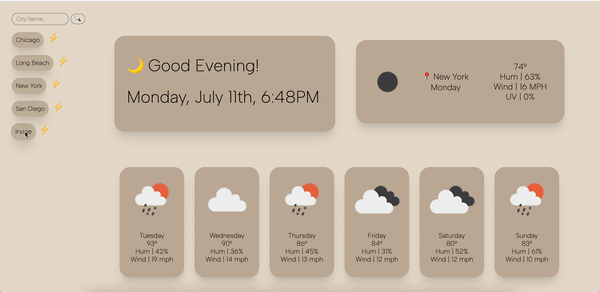

# Homework 6 - Weather Dashboard 

## Table of Contents 📚

- [Description](#description)
- [Preview](#preview)
- [Installation](#installation)
- [Usage](#usage)
- [Credits](#credits)
- [License](#license)
- [Links](#links)

## Description 📋

Modern and minimalistic weather dashboard. Designed to show only the pertinent information about the weather such as current temperature, humidity, wind speed, UV index and future forecasts. Saves up to 10 searched cities at a time. 

## Preview 📸

## Usage 🖥

User can favorite the deployed site to their browser to regularly visit and search the forecast of their desired city. 

## Links 💾

- Repository: https://github.com/mxhuisken/hw6_weather
- Deployed: https://mxhuisken.github.io/hw6_weather/